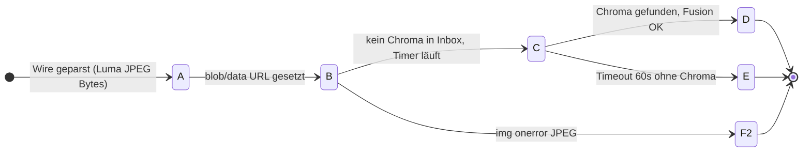

# LoRa-Bild (LUMA / CHROMA) — UI-Zustände und Schichten

**Zweck:** Einheitliche Begriffe für Empfang und Anzeige im Messenger, getrennt von **Bluetooth/Meshtastic-Timeouts** (Stack) und **App-Wire** (eine LUMA-Zeile + eine CHROMA-Zeile).

**Code:** `frontend/frontend/components/chat-message-body.tsx` (`LoRaProgressiveLumaBody`, `LoRaChromaOrphanBody`), Parser `frontend/frontend/lib/lora-progressive-image-client.ts`. Wire-Spez-Kommentar: `src/morgendrot-image-transport-policy.ts`.

---

## 1. Zwei Schichten (immer zuerst klären)

| Schicht | Typische Symptome | Wer „fixt“? |
|--------|-------------------|-------------|
| **Stack** | `Packet timed out`, `NO_RESPONSE` / error 8, abgebrochene BLE-Übertragung | Firmware / Meshtastic / Abstand / Retry auf Senden |
| **App** | Wire zu kurz, `]]` fehlt, Base64 ungültig, LUMA ohne CHROMA, JPEG nicht dekodierbar | Parser + UI in diesem Repo |

Ein stabiles **Zwei-Phasen-Modell** in der UI hilft **nicht**, wenn der **komplette** LUMA-String schon auf dem Weg zum Heltec stirbt — dann bleibt die App im **Pre-parse**-Bereich.

---

## 2. Pre-parse (Wire noch nicht als `MORG_LUMA_V1` akzeptiert)

Der Parser verlangt u. a. volle Länge bis `]]` gemäß Headerfeld `len` (`splitProgressiveWire` in `lora-progressive-image-client.ts`). **Abgeschnittene** Nachrichten liefern **`parseLoraProgressiveMessage` → `null`**.

Dann rendert `ChatMessageBody` **nicht** `LoRaProgressiveLumaBody`, sondern den **allgemeinen Fallback** (Hinweis „LoRa-Bild-Wire erkannt, Dekodierung fehlgeschlagen …“ + Rohinhalt), sofern Marker im Text vorkommen.

**Zustände (Doku):**

- **F0 — Wire unvollständig / unparsebar:** Marker oder Anfang vorhanden, formaler Parse fehlgeschlagen → Fallback-Zweig (kein Eintritt in A–E unten).
- **F1 — Wire fremd:** kein bekannter Marker → generischer Text/Wildnis-Hinweis.

---

## 3. Post-parse (nach erfolgreichem LUMA-Parse, Komponente `LoRaProgressiveLumaBody`)

Hier gilt ein **binärer** Ablauf (kein JPEG-Scanline-„Progressive“).

| ID | Kurzname | Nutzer sichtbar |
|----|-----------|-----------------|
| **A** | Dekodierung / Vorbereitung | „Bild wird dekodiert…“ |
| **B** | Monochrom (oder schon fusioniert) | S/W- oder Farbbild (``) |
| **C** | Warten auf Farbe | Badge „Unvollständig“ + „Farbübertragung läuft…“ |
| **D** | Voll | Fusioniertes Bild |
| **E** | Chroma-Timeout | S/W bleibt + Hinweis Timeout |
| **F2** | JPEG-Oberfläche | Formales Wire ok, **Anzeige** scheitert → Hinweis, Export Roh-Luma weiter möglich |

**Verwaistes CHROMA** (Phase 2 ohne passendes LUMA in der Inbox): eigene Darstellung `LoRaChromaOrphanBody` — kein globaler Cache; Paarung über `from` + `msgId` + Zeitfenster (`findPartnerChromaJpeg`).

---

## 4. Sichtbarkeitstester (Feld)

Senden eines LUMA/CHROMA-Strings als normale **Text**-Mesh-Nachricht (`TEXT_MESSAGE_APP`) beweist: **physikalische** Ankunft auf einem Zweitgerät. Wenn dort die „Textwüste“ sichtbar ist, der Messenger hier aber **F0** zeigt, liegt der Fehler in **Normalisierung / Parser / Länge** — nicht im Funk.

---

## 5. Nächste Erweiterungen (optional)

- Gezieltes **Retry** nur CHROMA (Sender- oder Empfängerseite).
- Parser-Rückgabe mit **Grund** (`truncated`, `bad_base64`, …) statt nur `null`, um F0-Texte zu schärfen ohne den kompletten Rohstring zu dominieren.

## 6. Mehrsegment-Transport (Plan)

Für große LUMA-/CHROMA-Bytes über viele Meshtastic-Texte: normativer Entwurf **`docs/LORA-MORGENDROT-S-ARQ-SPEC.md`** (Segment-Frames, CRC, NAK-Bitmask, \(L_{\max}=500\)‑Budget).
