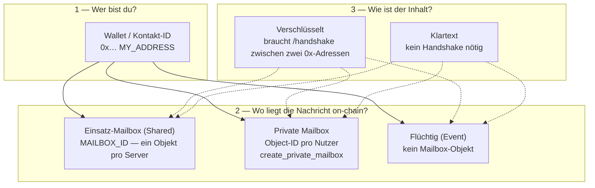

# Mailbox-Begriffe — ehrliche Klärung (M1 + M4d)

**Zweck:** Missverständnisse beseitigen, die oft aus „Shared vs. Private“ und „Handshake“ entstehen.  
**Stand:** 2026-05-20  
**Technik:** `docs/MESSAGING-MAILBOX-SSOT-SPEC.md`, `docs/MESSENGER-KANAL-MAILBOX-MEILENSTEINE.md`, **`docs/SENDEWEGE-KANAL-MAILBOX-UEBERSICHT.md`**, Move `messaging.move`

---

## Kurzantwort

| Frage | Antwort |
|-------|---------|
| Gibt es nur „Morgendrot-Mailbox“ und „eigene Mailbox“? | **Nein.** Es gibt **zwei verschiedene Chain-Objekte** mit unterschiedlicher Rolle — plus **zwei unabhängige Sende-Achsen** (Verschlüsselung × Persistenz). |
| Ist „eigene Mailbox“ dasselbe wie Shared? | **Nein.** Shared = **ein Postamt pro Einsatz/Server**. Private = **dein persönliches Postfach** (`create_private_mailbox`). |
| Braucht Shared einen Handshake? | **Nicht zum „Beitreten“.** Handshake ist **Schlüsselaustausch zwischen zwei Wallet-Adressen** für **verschlüsselten Chat** — unabhängig davon, ob in Shared- oder Private-Mailbox gespeichert wird. |
| Braucht Private einen Handshake zum Erstellen? | **Nein.** `/create-private-mailbox` reicht (Tresor entsperrt). |
| Braucht verschlüsselter Chat einen Handshake? | **Ja** — egal ob Speicherort Shared-Mailbox, Private-Mailbox oder Event. |
| Kann Shared verschlüsselt **und** Klartext? | **Ja.** Das sind **getrennte Schalter** in der UI (Transport-Card). |
| Was ist `create_globals`? | **Einmaliger Admin-Schritt** nach Paket-Deploy: legt VaultRegistry, **Shared Mailbox**, CommandRegistry an → `MAILBOX_ID` in `.env`. **Kein** Endnutzer-„Beitreten“. |

---

## Die drei Ebenen (nicht vermischen)



**Merksatz:** Handshake gehört zu **Ebene 3 (Verschlüsselung zwischen Kontakten)**, nicht zu „Mailbox beitreten“.

---

## 1. Einsatz-Mailbox (Shared) — „Morgendrot-Standard“

| | |
|--|--|
| **Move** | `Mailbox` aus `create_globals` |
| **Konfiguration** | `MAILBOX_ID` in Server-`.env` (Boss/Deploy) |
| **Wer schreibt hinein?** | Alle Nutzer **dieses Servers/Einsatzes** — Nachrichten werden unter `(sender, recipient)` Wallet-Adressen abgelegt |
| **Nutzer-Aktion „beitreten“** | **Keine.** Wenn dein Messenger an diesen Server hängt, nutzt er automatisch diese `MAILBOX_ID` |
| **Verschlüsselt möglich?** | Ja (`store_encrypted_message*`) — **nach** Handshake mit dem Kontakt |
| **Klartext möglich?** | Ja (`store_plaintext_message*`) — ohne Handshake |
| **Flüchtig (Event) statt Mailbox?** | Ja — Schalter „Flüchtig (Event)“ in der Transport-Card |

`create_globals` ist **nur** der Admin-Schritt nach neuem `PACKAGE_ID`-Deploy:

```bash
iota client call --package <PACKAGE_ID> --module messaging --function create_globals --gas-budget 10000000 --json
```

Aus dem Event `GlobalsCreated`: `mailbox_id`, `vault_registry_id`, `command_registry_id` → in `.env` eintragen, Backend neu starten.

---

## 2. Private Mailbox — „Eigene private Mailbox“

| | |
|--|--|
| **Move** | `PrivateMailbox` via `create_private_mailbox` |
| **Erzeugen** | UI **„Eigene private Mailbox erstellen“** oder `/create-private-mailbox` |
| **Besitzer** | Deine Wallet-Adresse (`owner` on-chain) |
| **Wer kann empfangen?** | **Nur der Owner** (`assert_private_mb_recipient` in Move) |
| **Handshake zum Erstellen?** | **Nein** |
| **Verschlüsselt an dich senden?** | Kontakt braucht **deine Mailbox-Object-ID** (Profil-QR / Telefonbuch) **und** für E2EE den **Handshake mit deiner Wallet** |
| **Klartext an dich?** | Mailbox-Object-ID reicht (kein Handshake) |

Private Mailbox ist **nicht** „noch eine Shared Mailbox“. Sie ist ein **eigenes Chain-Objekt**, das du anderen gibst, damit sie **dich** dort erreichen — statt in das gemeinsame Einsatz-Postamt.

---

## 3. Handshake — wofür wirklich?

**Handshake (`/handshake` + `/connect`)** = ECDH: zwei Wallet-Adressen tauschen öffentliche Keys aus.

| Situation | Handshake nötig? |
|-----------|------------------|
| Private Mailbox **erstellen** | Nein |
| Shared Mailbox **nutzen** (Server hat `MAILBOX_ID`) | Nein (automatisch) |
| **Verschlüsselte** Nachricht an Kontakt | **Ja** |
| **Klartext**-Nachricht | Nein |
| Kontakt hat **eigene Mailbox-ID** im Telefonbuch | Handshake nur für **Verschlüsselung**; Routing nutzt dann **seine** Object-ID (M4b) |

Falsch wäre: „Shared braucht Handshake, Private nicht“ — **Verschlüsselung** braucht Handshake, **Mailbox-Typ** nicht.

---

## 4. Was du im Messenger heute machst

### Als normaler Nutzer

1. **Kontakt-ID teilen:** deine Wallet `0x…` (nicht `MAILBOX_ID`!)
2. **Persistent + Einsatz-Postamt:** nichts extra — Server-`MAILBOX_ID` gilt
3. **Eigene private Mailbox:** Button in Transport-Card (Modus „Persistent (Mailbox)“) oder Identität → Object-ID wird lokal gespeichert + Profil-QR
4. **Kontakt mit privater Mailbox:** dessen **Wallet + optional Mailbox-Object-ID** per QR/Telefonbuch (Feld „Alternative Mailbox-ID“)
5. **Verschlüsselt chatten:** `/handshake` → `/connect` (oder UI-Äquivalent)

### Als Boss/Admin (einmal pro Paket-Deploy)

1. `npm run deploy:move-package` → `PACKAGE_ID`
2. `create_globals` → `MAILBOX_ID`, `VAULT_REGISTRY_ID`, … in `.env`
3. Backend neu starten

---

## 5. Mehrere PACKAGE_IDs (später)

**Nicht** wie Chat-Räume wechseln, sondern **Einsatzprofile** (Feuerwehr vs. Katastrophenschutz) — mit Warnung und getrennten privaten Mailboxes/Kontakten pro Profil.  
Roadmap: **§ H.24b** in **`docs/ROADMAP-FAHRPLAN.md`**, Spez: **`docs/PACKAGE-PROFILE-WECHSEL-SPEC.md`**.

---

## 6. Zielbild vs. Ist (ehrlich)

| Vision | Ist heute |
|--------|-----------|
| Übersicht „Meine Mailboxes“ | **Teilweise:** Einsatz-Mailbox (Server-Status) + Liste **eigener** privater Mailboxes (lokal, ab v2-Store) |
| Mehrere private Mailboxes | **Ja** on-chain erstellbar; UI speichert Liste + **eine aktive** für Profil-QR |
| Mehrere Shared Mailboxes pro Nutzer | **Nein** (bewusst ausgeschlossen, § H.22) — ein `MAILBOX_ID` pro Server/Einsatz |
| „Shared beitreten“ per ID | **Nicht nötig** — Shared = Server-Konfiguration; „beitreten“ = anderen **Server/Bundle** nutzen |
| Handshake-Status pro Kontakt | In Verbindungs-/Chat-UI (peerMap), nicht pro Mailbox |
| Vier Ziel-Mailboxen pro Kontakt (Shared/Privat/Team/Puffer) | **Ist (M4e):** Telefonbuch + Send-Dropdown — **`docs/KONTAKT-MAILBOX-VIER-SLOTS-ZIELBILD.md`** |
| Eingehende Handshake-Anfrage sichtbar | **Teilweise:** Posteingang + Toast + Badge — **`docs/HANDSHAKE-ANFRAGEN-UX.md`**, **§ H.27** |

---

## 7. UI-Begriffe (empfohlen)

| Alt / missverständlich | Besser |
|------------------------|--------|
| Morgendrot-Mailbox | **Einsatz-Mailbox (Server)** |
| Eigene Mailbox (= Shared?) | **Eigene private Mailbox** |
| Mailbox beitreten | **Kontakt hinzufügen** (Wallet ± Mailbox-Object-ID) |
| Handshake für Mailbox | **Handshake für verschlüsselten Chat** |

---

## 8. Verwandte Dateien

| Bereich | Pfad |
|---------|------|
| Move Shared | `create_globals` → `Mailbox` |
| Move Private | `create_private_mailbox` → `PrivateMailbox` |
| Persistenz + E2EE | `docs/MESSAGING-MAILBOX-SSOT-SPEC.md` |
| API-Befehl | `/create-private-mailbox` in `mailbox-commands.ts` |
| UI Erstellen | `chat-view-private-mailbox-create-button.tsx` |
| Lokale Liste | `frontend/frontend/lib/my-private-mailbox-store.ts` |
| Send an Kontakt-Mailbox | `contact-mailbox-routing.ts`, M4b |
