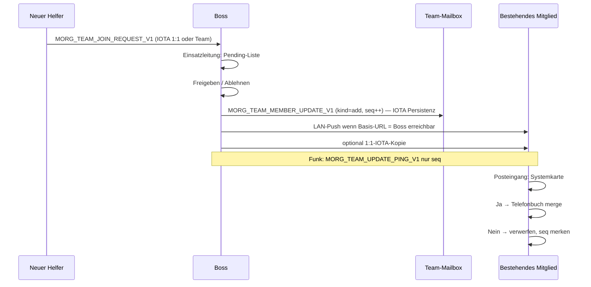

# Team-Member-Update & Einstiegs-Wizard — Spec (P0–P2)

**Stand:** 2026-06-16 (§4 Boss bei 0 — Greenfield-Einstieg; zuvor §3.5 Telegram, §8 Transport)  
**Status:** **Spec** — Implementierung startet mit **P0 Wizard-Skelett**; Wire + LAN-Zustellung **Phase P1**, Join-Request **P2**  
**Zweck:** Geführter **linearer** Erststart (Boss / Helfer / Wanderer) + **spontaner Helfer-Zugang** mit boss-signiertem Team-Update und Empfänger-Bestätigung — **ohne** Duplikat des Handoff-Export-Assistenten.  
**Verwandt:** `docs/EXPORT-ASSISTENT-REFERENZ.md`, `docs/GERAET-PROVISIONIEREN-WIZARD.md`, `docs/HANDOFF-UND-MODUS-ZIELBILD.md`, `docs/API-INITIAL-PROFILE.md`, `docs/PROVISIONING-PAYLOAD-CRITIQUE.md`, `docs/SYNC-SOURCE-OF-TRUTH-UND-KONFLIKTE.md`, `docs/TRANSPORT-AND-IOTA-LAYERS.md`, `docs/TELEGRAM-INTEGRATION-ZIELBILD.md` **§6** (Telegram-Alarmgruppe optional), `docs/ROADMAP-FAHRPLAN.md` **§ H.16** (Boss-LAN Ist), **§ H.36** (dieses Paket)

---

## 1. Leitprinzipien (verbindlich)

| Prinzip | Bedeutung |
|---------|-----------|
| **Orchestrieren, nicht duplizieren** | Wizard ruft bestehende Panels/APIs auf (Handoff, Seed-QR, Telefonbuch, Mailbox, Funk) — kein zweiter Export-Assistent. |
| **Linear für den Nutzer** | Feste Schritte, Fortschrittsanzeige, „Weiter / Zurück / Später“ — auch wenn intern mehrere Komponenten wechseln. |
| **IOTA = Persistenz** | Vollständiges Update **authoritativ** in Team-Mailbox (oder 1:1) — Quelle der Wahrheit, Offline/Fernhelfer. |
| **LAN = Zustellung** | Wenn Boss im gleichen Netz erreichbar: **schneller Push** über Boss-HTTP (bestehendes Relay) — **zusätzlich** zu IOTA, nicht stattdessen. |
| **Funk = Weckruf** | Kurzer Hinweis „Update seq N“ — **kein** volles Roster über LoRa. |
| **Boss = Autorität** | Join nur nach Boss-Freigabe; Updates boss-signiert oder Boss-ECDH-`.morg-pkg`. |
| **Empfänger bestätigt** | Jedes Gerät: Systemnachricht + **Ja / Nein** — kein stilles Überschreiben. |
| **Wanderer außerhalb** | Kein zentraler Boss-Sync; Solo-Wizard + Peering, kein Join-Request an Stab. |
| **Telegram optional** | Alarmgruppe-Beitritt **nie** Pflicht; eigener Wire **`MORG_TELEGRAM_ALARM_GROUP_V1`** — **nicht** in Member-Update mischen (**`docs/TELEGRAM-INTEGRATION-ZIELBILD.md`** §6). |

---

## 2. Abgrenzung: Handoff vs. Team-Update vs. Wizard

| | **Handoff-ZIP** (Ist) | **Team-Member-Update** (Soll) | **Einstiegs-Wizard** (Soll P0) |
|--|----------------------|-------------------------------|--------------------------------|
| **Wann** | Boss provisioniert **vor** dem Feld | Helfer kommt **später** dazu oder Daten ändern sich | **Erster Start** oder „Einrichtung fortsetzen“ |
| **Inhalt** | `.env`, Capabilities, Partner-Adressen, README + optional **`telegramAlarmGroup`** in Handoff-Extras | **Ein** Mitglied (+ Metadaten), `seq`, Boss-Signatur | Geführte Schritte zu Identität, IOTA, Funk, Team, **Telegram (optional)** |
| **Empfänger** | **Ein** neues Gerät | **Alle** bestehenden Team-Mitglieder (mit Bestätigung) | **Derselbe** Nutzer auf **eigenem** Gerät |
| **Transport** | ZIP / QR / optional IOTA-Handoff | IOTA Persistenz + LAN-Push + Funk-Ping | Lokal + Deep-Link; WLAN-QR → Basis-URL (§ H.16) |
| **Kontakte** | Partner-**Adressen** im ZIP; `initialProfile` **separat** | Merge in Telefonbuch wie `initialProfile.contacts[]` | Telefonbuch/Funk am Ende des Wizards |
| **UI-Ort** | Einsatzleitung → Helfer einrichten | Posteingang + Einsatzleitung (Join-Queue) | Dashboard / Erststart-Karte |

**Regel:** Wer **bereits** ein Handoff-ZIP hat → Wizard **überspringt** erledigte Schritte (Package, Mailbox, Rolle). Wer **neu** ohne ZIP startet → Helfer-Wizard endet mit Handoff-Import oder Join-Request.

---

## 3. Wire-Format

### 3.1 Text-Marker (Kanal: IOTA-Klartext-Mailbox)

Präfix analog `[[MORG_EMERGENCY_V1:…]]`:

```
[[MORG_TEAM_MEMBER_UPDATE_V1:{…json…}]]
```

**JSON-Envelope (Pflichtfelder):**

| Feld | Typ | Beschreibung |
|------|-----|--------------|
| `v` | `1` | Schema-Version |
| `kind` | `"add"` \| `"update"` \| `"remove"` | Art des Updates |
| `seq` | number | Monoton pro Team (`boss` + `teamId`); Empfänger ignorieren `seq ≤ lastApplied` |
| `teamId` | string | z. B. `metadata.teamid` oder `deploymentChannelTag` — max. 64 Zeichen |
| `boss` | string | Boss-IOTA-Adresse (`0x` + 64 Hex) |
| `issuedAt` | number | Unix ms |
| `member` | object | Siehe §3.2 (bei `remove`: nur `address` Pflicht) |
| `sig` | string | Boss-Signatur über kanonisches JSON **ohne** `sig` (Ed25519/secp256k1 — Freeze in P1; bis dahin Boss-ECDH-`.morg-pkg` als Transport) |

**Größe:** Ziel **≤ 4 KiB** UTF-8 pro Update (ein Mitglied). Kein Multi-Member-Bulk in v1.

### 3.2 `member`-Objekt (Anschluss an `initialProfile.contacts[]`)

| Feld | Typ | Pflicht | Anmerkung |
|------|-----|---------|-----------|
| `address` | string | ja | `0x` + 64 Hex |
| `name` | string | ja | Anzeigename / Callsign (1–120 Zeichen) |
| `roleTags` | string[] | nein | z. B. `["Medic","Funker"]` — wie `API-INITIAL-PROFILE.md` |
| `meshNodeId` | string | nein | Meshtastic `!…` — Telefonbuch-Feld |
| `telegramChatId` | string | nein | falls bekannt |
| `roleId` | number | nein | 0–63, Informationszweck (Rechte weiter aus `.env`) |
| `handoffLabel` | string | nein | Bezeichnung aus Boss-Registry |

**Merge bei „Ja“:** `POST /api/contact-labels/apply-initial-profile` bzw. Client-Äquivalent — **ein** Kontakt aus `member` in `contacts[]`-Form.

### 3.3 Join-Request (Helfer → Boss)

```
[[MORG_TEAM_JOIN_REQUEST_V1:{…json…}]]
```

| Feld | Typ | Beschreibung |
|------|-----|--------------|
| `v` | `1` | |
| `requestId` | string | UUID / random id — Dedup |
| `applicant` | object | Gleiche Felder wie §3.2 `member` (mindestens `address`, `name`) |
| `teamId` | string | optional — wenn aus Boss-QR/Handoff bekannt |
| `boss` | string | Ziel-Boss-Adresse |
| `issuedAt` | number | Unix ms |
| `note` | string | optional, max. 500 Zeichen („Medic, Sektor Süd“) |

**Kein** Join-Request ohne erreichbare Boss-Adresse (aus Handoff, QR oder manuell).

### 3.4 Funk-Weckruf (Fallback, optional P3)

```
[[MORG_TEAM_UPDATE_PING_V1:{"v":1,"seq":42,"teamId":"…","boss":"0x…"}]]
```

Nur **Hinweis** — Empfänger holt volles Update per IOTA/Queue. **Kein** `member`-Body über LoRa. Bei Telegram-Gruppen-Update: Ping mit `"hint":"telegram_group"` (optional P3).

### 3.5 Telegram-Alarmgruppe (späterer Link-Wechsel — B4b)

**Separater Wire** — **nicht** `MORG_TEAM_MEMBER_UPDATE_V1` (kein Telefonbuch-Merge, kein „Ja/Nein“ für Kontakte).

```
[[MORG_TELEGRAM_ALARM_GROUP_V1:{…json…}]]
```

| Feld | Typ | Pflicht | Beschreibung |
|------|-----|---------|--------------|
| `v` | `1` | ja | Schema-Version |
| `kind` | `"invite_link"` \| `"revoke_hint"` | ja | `invite_link` = neuer/rotierter Link; `revoke_hint` = alte Gruppe ungültig (ohne neuen Link) |
| `tgSeq` | number | ja | Monoton pro `teamId` — **eigen** von Member-`seq` |
| `teamId` | string | ja | wie §3.1 |
| `boss` | string | ja | Boss-IOTA-Adresse |
| `issuedAt` | number | ja | Unix ms |
| `label` | string | nein | Anzeigename (z. B. „Einsatz Team Alpha“) |
| `inviteLink` | string | bei `invite_link` | `https://t.me/+…` — max. 512 Zeichen |
| `sig` | string | nein | Boss-Signatur (Freeze P1; bis dahin Boss-`.morg-pkg`) |

**Größe:** ≤ 2 KiB. **Transport:** wie §8 (IOTA Persistenz + LAN Zustellung + Funk-Ping).

**Empfänger-UI:** Posteingang-Systemkarte §7.4 — **Gruppe beitreten** · **Später erinnern** · **Nicht interessiert** (kein Telefonbuch-Merge).

**Handoff (Erststart):** Gleiche Felder in **`.morgendrot-handoff-extras.json`** — Wizard liest lokal, **kein** Wire nötig bis Boss später rotiert.

---

## 4. UI — Boss-Einstiegs-Wizard (linear, **Boss bei 0**)

**Leitprinzip:** Ein neuer Boss startet **ohne** Wallet, Adresse, Package-ID, Mailbox oder Team — der Wizard führt **linear** von null bis zum ersten Helfer-Handoff. Er **orchestriert** bestehende APIs/Panels; er ist **kein** zweiter Export-Assistent.

**Einstieg:**

| Ort | Wann |
|-----|------|
| **Erststart-Karte** (Dashboard) | Noch kein Profil/Handoff/Seed — drei Wege: **Einsatzleitung**, **Einsatz-Helfer**, **Privat/Solo** |
| **Einstellungen** → Einstiegs-Wizard | „Einrichtung fortsetzen“ / „Wizard öffnen“ |
| **Später** | Nach Handoff-Import oder vorkonfigurierter `.env` — erledigte Schritte werden **übersprungen** |

**Modus:** Dialog mit **Schritt X von Y**; „Später“ / „Überspringen“ für optionale Schritte.

### 4.1 Erststart — drei Wege (verbindlich)

| Nutzerwahl | Wizard-Pfad | Kurz |
|------------|-------------|------|
| **Einsatzleitung — ich starte den Einsatz** | `boss` | Greenfield: Wallet → Chain → Postfächer → Helfer |
| **Einsatz-Helfer — Handoff vom Boss** | `helper` (Handoff-Flow, kein linearer Wizard-Dialog) | ZIP / Join-Request |
| **Privat / Solo** | `wanderer` | Wallet → optional Postfach |

**Regel:** „Boss bei 0“ gilt nur für Pfad **`boss`**. Helfer erwarten weiterhin ein Boss-Handoff oder Join-Freigabe.

### 4.2 Boss-Schritte (Soll — Code: `BOSS_STEP_ORDER`)

| # | `stepId` | Titel (Nutzer) | Inhalt (orchestriert) | Überspringen wenn |
|---|----------|----------------|------------------------|-------------------|
| 1 | `wallet` | **Wallet** | Seed neu / importieren / Tresor entsperren (`ONBOARDING-WALLET-UX-SPEC.md` §2) | Keys in Sitzung (`hasKeys` / persistierter Signer) |
| 2 | `address` | **IOTA-Adresse** | Adresse anzeigen & kopieren | Adresse in Status |
| 3 | `package` | **Move-Package** | **Deploy** (`POST /api/deploy-package`) **oder** bestehende Package-ID (`/set-package-id`); RPC/Netzwerk | `PACKAGE_ID` gesetzt |
| 4 | `server-mailbox` | **Server-Postfach** | Private Mailbox on-chain (`/create-private-mailbox`) → `MAILBOX_ID` in `.env` | `MAILBOX_ID` gesetzt |
| 5 | `team` | **Team** | Team-Mailbox (`/create-team-mailbox`), Einsatz-Name (`HANDOFF_LABEL`) | Team-Label / Team-MB bekannt |
| 6 | `telegram-bot` | **Telegram Bot** (optional) | Bestehendes Einstellungs-Panel | immer überspringbar |
| 7 | `telegram-group` | **Alarmgruppe** (optional) | Bestehendes Einstellungs-Panel | immer überspringbar |
| 8 | `meshtastic` | **Funk** (optional) | Node-ID / Kanal | Node-ID gespeichert |
| 9 | `done` | **Fertig** | Checkliste → Dashboard | — |

**Nachtrag 2026-06-16:** Schritt `helpers` (**Erste Helfer**) aus dem Boss-Wizard **entfernt** — der Einstiegs-Wizard richtet nur **diesen Messenger** ein; Helfer-Provisionierung bleibt **Einsatzleitung → Helfer einrichten** (`HandoffProvisionEntry`). Legacy-Fortschritt mit `helpers` wird beim Laden übersprungen.

**Vor Schritt 3 (Deploy):** Server-Rolle `ROLE=boss` setzen (`POST /api/config`), falls Backend läuft — sonst `403` bei Deploy.

**Standalone ohne Basis-URL:** Schritte 3–4 nutzen Direkt-RPC / lokale Stores; Deploy nur wenn Boss-HTTP erreichbar.

### 4.3 Abgrenzungen

| Thema | Im Boss-Wizard? |
|-------|-----------------|
| Seed für **andere** Helfer generieren | **Nein** — **Einsatzleitung → Helfer einrichten** (eigener Flow, nicht Wizard-Schritt) |
| Capabilities-Matrix / `ROLE_ID` fein | **Nein** — Link „Experte“ in Helfer einrichten |
| Team-Member-Update-Wire (`add`/`remove`) | **Nein** — Posteingang / Einsatzleitung (§7) |
| Rechte ändern an laufenden Helfern | **Nein** — neues Handoff-ZIP (`docs/EINSATZ-BOSS-ABLAUF.md`) |

### 4.4 Feldtest „Boss bei 0“

**Checkliste (manuell + Playwright):** **`docs/FELDTEST-BOSS-BEI-0.md`**

1. Frische Installation: kein Seed, keine IDs in `.env`
2. Erststart → **Einsatzleitung**
3. Wallet → Adresse sichtbar
4. Package deployen (oder ID eintragen)
5. Server- + Team-Postfach anlegen
6. Ersten Helfer provisionieren
7. Dashboard/Einsatzleitung ohne manuelles `.env`-Editieren nutzbar

---

## 5. UI — Helfer-Einstiegs-Wizard (Einsatz)

| Schritt | Titel | Inhalt | Überspringen wenn |
|---------|-------|--------|-------------------|
| 1 | **Handoff** | ZIP importieren **oder** „Noch kein ZIP — Join anfragen“ | Handoff bereits angewendet |
| 2 | **Telegram-Alarmgruppe** | Nur wenn `inviteLink` aus Handoff-Extras/README: QR + **Gruppe beitreten** + optional „Link beim Öffnen anzeigen“ + **Später** / **Nicht interessiert** — **`docs/TELEGRAM-INTEGRATION-ZIELBILD.md`** §6.6.1 | Kein Link im Handoff **oder** Nutzer dismissed |
| 3 | **Wallet** | Seed-QR / Mnemonic (`GERAET-PROVISIONIEREN-WIZARD.md`) | Keys in Sitzung |
| 4 | **Ich im Team** | Callsign, Node-ID | Felder gesetzt |
| 5 | **Peering** | Boss-QR scannen / Kontakt-ID | Partner gesetzt |
| 6 | **Fertig** | Chat öffnen | — |

**Zweig „Spontan ohne ZIP“ (Schritt 1b):** Formular §3.3 → sendet Join-Request an Boss → „Warte auf Freigabe“.

---

## 6. UI — Wanderer-Wizard (Privat/Solo)

| Schritt | Titel | Inhalt |
|---------|-------|--------|
| 1 | **Privat starten** | Abgrenzung: kein Boss, kein Team-Sync |
| 2 | **Wallet** | Seed import / neu / App-PW |
| 3 | **Funk** (optional) | Node-ID |
| 4 | **Fertig** | Nachrichten |

**Kein** Join-Request, **kein** Team-Member-Update-Empfang über Boss-Kanal ( höchstens manuelles Peering mit Freunden).

---

## 7. Join-Request + Update-Flow (Einsatz)



### 7.1 Zustände (Boss-Registry / lokal)

| Status | Bedeutung |
|--------|-----------|
| `join_pending` | Request eingegangen |
| `join_rejected` | Boss abgelehnt |
| `update_published` | `MORG_TEAM_MEMBER_UPDATE_V1` gesendet (`seq` bekannt) |
| `member_active` | Mindestens ein Mitglied hat „Ja“ bestätigt (Boss-Sicht) |

### 7.2 Systemnachricht im Posteingang (Empfänger)

**Titel:** `Neues Team-Mitglied`  
**Text:** `{name} ({callsign}) — Funk {meshNodeId oder „—“}`  
**Aktionen:** **`Daten übernehmen`** (Ja) · **`Ablehnen`** (Nein)  
**Hinweis:** „Von Einsatzleitung ({boss kurz}) · Update #{seq}“

Bei **Ja:** Merge §3.2 → Toast „Kontakt übernommen“.  
Bei **Nein:** Eintrag in `rejectedTeamUpdates[]` (localStorage), gleiches `seq` nicht erneut naggen.

### 7.3 Boss-UI (Einsatzleitung)

Neuer Block **„Beitrittsanfragen“** (P2):

- Liste pending Requests mit Vorschau
- **Freigeben** → erzeugt §3.1 + verteilt
- **Ablehnen** → optional kurze Antwort an Applicant (Klartext, kein neuer Wire-Typ in v1 nötig)

Zusätzlich (B4b, P1): **„Telegram-Alarmgruppe aktualisieren“** → sendet §3.5 an Team (`tgSeq++`).

### 7.4 Systemnachricht — Telegram-Alarmgruppe (B4b)

**Auslöser:** `MORG_TELEGRAM_ALARM_GROUP_V1` (`kind: invite_link`) empfangen und verifiziert.

**Titel:** `Neue Telegram-Alarmgruppe`  
**Text:** „Einsatzleitung ({boss kurz}) hat Alarmgruppe „{label}“ eingerichtet. Nur Hinweise — Inhalte in Morgendrot.“  
**Aktionen:**

| Aktion | Verhalten |
|--------|-----------|
| **Gruppe beitreten** | `window.open(inviteLink)`; `tgSeq` in `appliedTelegramGroupTgSeq` merken |
| **Später erinnern** | Karte in `snoozedTelegramGroupCards[]`; erneut nach 24 h oder App-Start |
| **Nicht interessiert** | `dismissedTelegramGroupTgSeq[]`; keine erneute Karte für gleiches `tgSeq` |

**Kein** Merge ins Telefonbuch. Link zusätzlich unter **Einstellungen → Telegram** nachholbar.

---

## 8. Transport: Persistenz vs. Zustellung

### 8.1 Zwei Achsen (nicht verwechseln)

| Achse | Frage | Regel |
|-------|--------|--------|
| **Persistenz** | Wo liegt die authoritative Kopie? | **IOTA-first** — Team-Mailbox (oder 1:1), boss-signiert, `seq` monoton |
| **Zustellung** | Wie kommt es schnell an? | **LAN-first**, wenn Boss erreichbar — **parallel** zu IOTA, nicht als Ersatz |

Formel: **„IOTA speichert, LAN liefert schnell.“**

### 8.2 Bereits im Repo (Ist — Onboarding + Chat-Relay)

| Baustein | Code / API | Nutzen heute | Nutzen Team-Update |
|----------|------------|--------------|-------------------|
| **LAN-IP ermitteln** | `GET /api/lan-install-urls`, `src/lib/lan-install-urls.ts` | WLAN-QR in Helfer einrichten | Boss-IP für Basis-URL |
| **Install-QR** | `frontend/lib/install-qr.ts`, `LanInstallQrPanel` | PWA + `http://<LAN>:3342` | Helfer im gleichen WLAN |
| **Boss-Relay HTTP** | Basis-URL → `/api/*` (`messenger-standalone-relay.ts`, `mailbox-send-hybrid.ts`) | Chat, Posteingang, Handshake | **P1:** dedizierter Team-Sync-Push |
| **Peering-QR mit LAN** | `peering-qr-actions.tsx` | RPC/Package ohne Handoff-ZIP | Wizard Schritt Peering |

**Lücke (Soll P1):** Kein Transport-Layer wählt automatisch **LAN vor IOTA** für `MORG_TEAM_MEMBER_UPDATE_V1`; kein UI „Zugestellt über …“.

### 8.3 Zustell-Hierarchie (Team-Member-Update)

Boss erzeugt **ein** Update (`seq++`), dann **parallel**:

| Prio | Kanal | Wann | Inhalt | Phase |
|------|--------|------|--------|-------|
| **0** | **Boss-LAN HTTP** | Client: Basis-URL zeigt auf Boss-LAN **und** `GET /api/status` OK | Volles Update — zunächst als Klartext-Nachricht über Relay; **P1b:** optional `POST /api/team-sync/push` | **P1** |
| **1** | **IOTA Klartext** | Immer (Persistenz) | `MORG_TEAM_MEMBER_UPDATE_V1` → Team-Mailbox | **P1** |
| **2** | **IOTA 1:1** | Keine Team-Mailbox | Gleiches Update an jedes Mitglied | **P1** |
| **3** | **Boss-Offline-Queue** | Boss ohne Netz | Retry IOTA + LAN wenn Basis wieder da | **P1** |
| **4** | **Funk Ping** | Kein LAN, IOTA verzögert | Nur `MORG_TEAM_UPDATE_PING_V1` (`seq`, `teamId`, `boss`) | **P3** |
| **5** | **Boss-`.morg-pkg`** | Signatur noch offen | ECDH-Envelope statt Klartext-Marker | **P1** (Fallback) |

**Nicht in dieser Hierarchie:** Sendepfad **Ad-hoc** = **BLE Handy↔Handy** (Platzhalter) — **≠ WLAN/LAN**. Siehe `docs/TRANSPORT-AND-IOTA-LAYERS.md`, Roadmap Ad-hoc-Backlog.

**mDNS/Bonjour:** **P2-Komfort** — für Einsätze reicht oft WLAN-QR + gespeicherte Basis-URL (§ H.16).

### 8.4 UI-Feedback (Boss + Empfänger)

Nach Freigabe / beim Empfang anzeigen (Beispiel):

```
Zugestellt: Lokales Netz ✓ · IOTA ✓ · Funk-Hinweis ✓
```

| Rolle | Anzeige |
|-------|---------|
| **Boss** (nach Freigabe) | Pro Kanal: OK / ausstehend / fehlgeschlagen; Retry-Button für IOTA-Queue |
| **Empfänger** (Systemkarte §7.2) | Zeile „Empfangen über: LAN“ oder „IOTA (Mailbox)“; bei nur Ping: „Funk-Hinweis — Update wird geladen …“ |
| **Wizard** (Helfer Schritt 2) | Telegram-Alarmgruppe aus Handoff; Schritt 1 = WLAN/Basis-URL testen |

Persistenz-Gate: **Ja/Nein** erst, wenn Payload verifiziert (Boss + `seq`) — unabhängig vom Zustellkanal.

### 8.5 Erkennung „gleiches Netz“ (v1 pragmatisch)

| Signal | Bedeutung |
|--------|-----------|
| `getApiBase()` = `http://192.168.x.x:3342` (oder RFC1918) | LAN-Relay-Kandidat |
| `GET /api/status` erfolgreich | Boss erreichbar → LAN-Push versuchen |
| Keine Basis-URL / Standalone ohne Relay | Nur IOTA (+ später Funk-Ping) |
| Gleiche `teamId` + gleicher `boss` in Handoff | Team-Kontext (kein Auto-Discovery ohne QR) |

---

## 9. Implementierungsphasen

| Phase | Lieferumfang |
|-------|----------------|
| **P0** | Wizard-Skelett Boss / Helfer / Wanderer; Schritte + Skip-Logik; **Helfer Schritt 2** Telegram (UI-Platzhalter wenn Link in Handoff-Extras); Deep-Links |
| **P1** | `MORG_TEAM_MEMBER_UPDATE_V1` + §3.5 `MORG_TELEGRAM_ALARM_GROUP_V1`; Posteingang §7.2 + §7.4; LAN-Push; Handoff-Extras B4b.2 |
| **P2** | `MORG_TEAM_JOIN_REQUEST_V1` + Boss Pending-UI + Freigabe → Update; optional mDNS |
| **P3** | Funk-Ping + Offline-Queue-Boss; Boss-Signatur `sig` freeze |

**P0-Dateien (Vorschlag):** `frontend/frontend/components/onboarding/` — `BossOnboardingWizard.tsx`, `HelperOnboardingWizard.tsx`, `WandererOnboardingWizard.tsx`, `onboarding-progress-store.ts`.

---

## 10. Sicherheit & Grenzen

- **Spoofing:** Updates ohne verifizierte Boss-Herkunft (`boss`-Adresse + `sig` oder Boss-`.morg-pkg`) → **nur anzeigen**, nicht auto-mergen.
- **Replay:** `seq` monoton; alte Updates verwerfen.
- **Privacy:** Keine Seeds, keine Handoff-Passwörter im Team-Update-Wire.
- **Größe LoRa:** Nie volles `member`-JSON per Funk — nur Ping (§3.4).
- **Move/Chain:** Kein neues On-Chain-Struct in v1 — alles Mailbox-Klartext + lokales Telefonbuch.

---

## 11. Offene Punkte (Freeze vor P1-Code)

1. ~~Exaktes Signatur-Schema (`sig`)~~ — **Freeze 2026-07-03:** `docs/MORG-TEAM-WIRE-SIG-SCHEMA.md` (Ed25519 personal message).  
2. Eindeutige `teamId`-Quelle: `metadata.teamid` vs. `deploymentChannelTag`.  
3. Soll **Freigabe** automatisch den Neuling auch in **bestehende** Helfer-Handoffs (Partner-Liste) schreiben — oder nur Telefonbuch-Sync?  
4. **P1b:** Eigener Endpoint `POST /api/team-sync/push` vs. bestehendes `/api/send-plain` mit System-Marker?

---

**Nächster Schritt:** P0 Wizard-Skelett gemäß §9 — linear, orchestriert, ohne neuen Wire.
