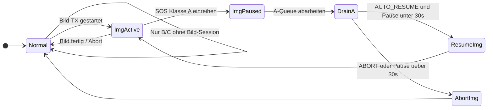
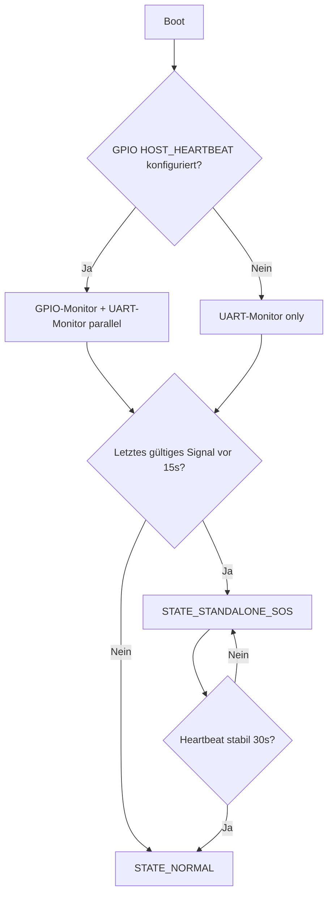

# Phase 2 – Heltec-Firmware-Spezifikation (Morgendrot)

**Status:** Planungsstand – **kein Pflicht-Umfang** für jedes Deployment.  
**Bezug App/Node:** Mesh Emergency Binary v2 bleibt auf **`MESH_V2_MAX_BYTES = 240`** (`src/messenger-nest/messenger-chain-wrap.ts`).

---

## 0. Strategische Leitlinie: Meshtastic-First (Baukasten)

| Regel | Inhalt |
|--------|--------|
| **Produkt** | Morgendrot-Messenger ist ein **Notfall-/Krisen-Tool**, kein Alltags-Chat wie Signal. |
| **Basis** | **Standard-Meshtastic** (Firmware + Client/Web) wo möglich; **kein großer Fork** und **kein eigenes Chunk-/Mesh-Protokoll**, solange ein **pragmatischer Weg** über Konfiguration, **Module** oder **Gateway** (z. B. MQTT → Morgendrot-Node) reicht. |
| **Gerät** | **Eine** Geräte-/Software-Basis (Heltec + Meshtastic); **keine** Produktlinie „anderer Gerätetyp“ – nur **Ausbaustufen** (z. B. mit/ohne Host/Display) derselben Rolle. |
| **Strom** | **Brownout-Schutz** und **Power-Management** bleiben **kritisch** (Hardware + Software) – **§8** und Host-Politik. |

**Was dieses Dokument ist:** eine **Referenz für tiefe Firmware-Erweiterungen** (Smart Buffer, hopweise NACK, strikte Priorisierung auf dem Relais), die **nur** verfolgt werden sollen, wenn nachgewiesen ist, dass **Meshtastic-Store-and-Forward + App-seitiges Chunking (mehrere v2-Pakete)** + ggf. **MQTT-Brücke** **nicht** ausreichen.

**Kurzordnung:** Zuerst **`docs/MESHTASTIC-BUILDING-BLOCKS.md`** (was 1:1 aus Meshtastic kommt) und **`docs/LORA-IOTA-DELAYED-UPLOAD-SPEC.md`** (Gateway-MVP). Diese Spec **danach** priorisieren, nicht parallel dazu als Default.

**Node-Seite (Delayed Upload IOTA):** [`../docs/LORA-IOTA-DELAYED-UPLOAD-SPEC.md`](../docs/LORA-IOTA-DELAYED-UPLOAD-SPEC.md) – **MVP** ohne pro-Hop-Firmware-Signatur.

---

## 1. Kritische Einordnung (vor Implementierung)

### 1.1 433 MHz „Cave Rescue Edition“

| Aspekt | Bewertung |
|--------|-----------|
| **Durchdringung** | Niedrigere Frequenz hilft in feuchtem Gestein/Wasserfilm **tendenziell** – real dominieren oft Mehrwegeausbreitung und lokale Geometrie; Feldtests in Zielhöhlen sind Pflicht. |
| **Duty Cycle / Leistung** | Planungsannahmen (z. B. höherer zulässiger Sendeanteil als bei typischen EU868-LoRa-Anwendungen) sind **regions- und subbandabhängig**. Vor Produkt-/Einsatzlabel: **juristische Klärung** (CE/RED, nationale ISM-Regeln). |
| **Hardware** | **Eigene 433-MHz-Bestellvariante** (SX1262 abgestimmt auf 433 MHz) + **abgestimmte Antennen**; kein 868er-RF-Frontend „umkonfigurieren“. |
| **Firmware** | **Bandprofil** (Build oder NVS): Kanalplan, TX-Leistung, **Duty-Accounting** strikt band-spezifisch. |

**Details zur Hardware, Antenne, Parametrisierung und Regulatorik:** → **§2.1 Cave Rescue Edition (verbindlich).**

### 1.2 Smart Buffer + NACK (**Option / Plan B**)

| Aspekt | Bewertung |
|--------|-----------|
| **Default** | Meshtastic **eigenes** Store-and-Forward und Routing nutzen; große Inhalte möglichst **am Rand** in **mehrere** PRIVATE_APP-Pakete (**App/Node**) splitten statt neuen Relais-Puffers zu bauen. |
| **Wenn doch nötig** | Harte Obergrenzen (**§6.1**): max. **3–4** parallele Transfers, **8–12** Chunks pro Transfer (Ring); bei Kapazitätsende **E2E-NACK** – nur als **kleines, isoliertes Modul** / Patch, nicht als paralleles Gesamtprotokoll. |
| **Sicherheit** | Buffer opak; kein Klartext auf Relais für E2E. |

### 1.3 Priorisierte Unterbrechung (SOS > Bild)

| Aspekt | Bewertung |
|--------|-----------|
| **Stack** | Praktisch **Queue-Disziplin** + **Session-Pause**, nicht PHY-Preemption. |
| **Zeitgrenze** | Pausiertes Bild darf den Kanal **max. 30 s** blockieren (kein unbegrenztes „Resume wartet“) – **§5.2**. |

### 1.4 RS485- / Kabel-Siphon-Brücke (Lackdraht-Hybrid)

| Aspekt | Bewertung |
|--------|-----------|
| **Einsatz** | Nur **kurze Patch-Strecke** (wassergefüllter Siphon, feuchter Fels), typ. **30–100 m** – **kein** Fern-Backbone, **kein** Ersatz für belastbares Zweidraht-Deployment. |
| **Physik (kritisch)** | **Klassisches RS485** ist **differentiell (A/B, Twisted Pair)**. **Zwei Adern (Twisted Pair)** = **Standard / bevorzugt**, sobald physikalisch möglich. **Ein** Lackdraht + **Erde/Wasser/Fels als Rückleiter** = **kein** normkonformes RS485; nur **Notlösung** (**§7.1**, **§7.3**): Baud **≤ 9600**, **starkes Framing + Retry**, **hohe Fehlerrate** als Normalfall ansetzen. |
| **Bridge-Ort (Priorität)** | **Festlegung:** Die **gesamte** Weiterleitungslogik (**LoRa ↔ UART/Draht ↔ LoRa**) soll **auf dem Heltec** laufen (**nicht** auf dem CM4). Der **CM4** ist **kein** Bridge-Prozessor; er dient höchstens **Konfiguration, Statusabfrage und UI** (**§7.2**, **§7.5**, **§7.6**). **Alternative nur für Labortests:** CM4 spricht den Draht-Transceiver direkt – **kein** Ersatz für das Einsatzziel „Heltec autark am Ufer“. |
| **Fail-Safe** | Steht **über** Feintuning (Auto-Baud): **>30 % Fehlerquote** (gleitendes Fenster) **oder** **Link-Timeout** → **sofort** `MODE_LORA_ONLY` (**§7.4**). |
| **Build** | **Feature-Flag, default AUS** – **§7**. |
| **Mesh-Ziel** | Beide Ufer sollen **dieselbe logische Mesh-Last** (Text, Status, LUMA/CHROMA-Fragmente im Rahmen v2) tragen können; Umsetzung als **deterministische Weiterleitung** (LoRa ↔ Draht ↔ LoRa), nicht als „RF durchs Kabel tunneln“. |

### 1.5 CM4 als Single Point of Failure

| Aspekt | Bewertung |
|--------|-----------|
| **Trigger** | **15 s** ohne gültigen Heartbeat → Minimalmodus – **§3.3, §11**. |
| **Umfang** | Nur **SOS + max. 5 vordefinierte Status-Codes + GPS** (falls Modul vorhanden); **keine** Bildaufnahme/-kompression ohne CM4. |

### 1.6 Energie-Management

| Aspekt | Bewertung |
|--------|-----------|
| **Hardware / Software** | Wie zuvor: Supercaps, Mess-IC vs. Fuel-Gauge, Schwellen in Firmware – **§8**. |

---

## 2. Hardware-Varianten (Planung)

| Edition | RF | Einsatz | Besonderheiten |
|---------|-----|---------|----------------|
| **Standard (EU868)** | ~868 MHz | Allgemein Outdoor/Mesh | EU868-Duty-Buchführung; Bild-Luftzeit kritisch. |
| **Cave Rescue (433)** | ~433 MHz ISM | Höhlen / hohe Feuchte | Verbindliche Referenz **§2.1**; Feldvalidierung. |

### 2.1 Cave Rescue Edition – verbindliche Festlegung

#### Referenz-Board (433 MHz, SX1262)

| Feld | Festlegung |
|------|------------|
| **Gerät** | **Heltec Wireless Stick Lite V3**, Bestellvariante **433 MHz** (Semtech **SX1262**, passendes passives RF-Frontend für 433 MHz). |
| **Hinweis** | Meshtastic/PlatformIO-Target typ. `heltec_wireless_stick_lite_v3` mit Region **EU_433** (o. ä.) – **exakten Build-Namen beim Fork gegen Datenblatt/Shop-SKU verifizieren** (433-MHz-Artikelnummer ≠ 868-MHz-SKU). |
| **NICHT** | 868-MHz-Stick mit „softwareseitigem“ 433-Tuning – verboten (Filter/PA-Mismatch). |

#### Antennenempfehlung

| Thema | Empfehlung |
|-------|------------|
| **Anschluss** | IPEX/U.FL wie am Board; kurzes **qualitativ hochwertiges** Pigtail, minimale Knickradius-Einhaltung. |
| **Typ** | Auf **433 MHz abgestimmte** Stab-/Flex- oder robuste **Outdoor-Antenne** (nicht 868er-Reservebestand). |
| **Mechanik** | In Höhlen: **IP-Schutz** (Kondensation, Spritzwasser), Befestigung gegen Abrieb am Fels; **λ/4** für 433 MHz ≈ **17,3 cm** – Dachlänge und Groundplane beachten. |
| **Abgleich** | SWR/VSWR-Check vor Dauereinsatz; feuchte Umgebung kann Detuning → Feldtest. |

#### SF / BW / Einstellungen vs. 868 MHz (Richtwerte)

Ziel: **einheitliche Meshtastic-Region-Profile** nutzen, aber Cave-Edition **explizites Profil** in NVS/Build:

| Parameter | Standard (868) | Cave (433) – Planung |
|-----------|----------------|----------------------|
| **Region** | `EU_868` | `EU_433` (oder nationales 433-Profil) |
| **BW** | typ. 125 kHz (Meshtastic-Default Long/Fast) | **gleiche BW-Familie** wie Mesh-Peers, sonst keine Kommunikation; Default **125 kHz** unless Bandplan erzwingt anderes |
| **SF** | SF7–SF12 je nach Modul | **Favorit längere Reichweite:** SF9–SF11 als Rettungs-Default, **wenn** Duty-Budget und Latenz es erlauben; **mit Peers abgestimmt** |
| **TX-Power** | gemäß EU868-Subband | **Strikt** gemäß **433-ISM-Subband** (oft **niedrigere ERP** als 868-LoRa – nicht „21 dBm kopieren“) |
| **Duty-Accounting** | 1 %-Regel (typ. Subbänder) | **Band-spezifisch**; Planungsannahme **bis ca. 10 %** nur dort, wo Regelwerk das **nachweislich** erlaubt |

**Firmware-Pflicht:** getrennte Konstanten `PROFILE_EU868` / `PROFILE_CAVE433` (Kanal, max ERP, Duty-Fenster).

#### Regulatorische Hinweise (Planung, keine Rechtsberatung)

| Thema | Inhalt |
|-------|--------|
| **433 MHz EU ISM** | Unterteilung in **Subbänder** mit unterschiedlichen **Duty-Cycle-** und **Leistungsgrenzen**; nicht alle Bereiche erlauben 10 % oder hohe Leistung. |
| **Cave Rescue Edition** | In Dokumentation/Gerätelabel: **Region/Band** und **max. ERP** aus gewähltem Subband; Nutzerhinweis **einzuhalten**. |
| **868 Standard** | Weiterhin **EU868**-konforme Buchführung (z. B. 1 %-Fenster je Subband). |

---

## 3. Betriebsmodi (Heltec-Firmware)

### 3.1 Endgerät (Terminal)

- Verbindung zum **Host (CM4/Browser)** über USB/BT wie heute.
- **TX (bevorzugt):** Große Inhalte **vom Host/App** in **mehrere** bestehende Mesh-v2-Pakete schneiden (kein neues Funkprotokoll). **Fallback:** nur wenn nötig, erweiterte Chunk-Schicht wie **§4**.
- **RX:** Reassembly im Host; Meshtastic liefert **einzelne** Pakete wie gehabt.
- **Mit Host:** Bildpipeline (Kamera, Kompression) auf Host; Heltec bleibt **Transport**.

### 3.2 Relais (Heltec ohne Host – „abgespeckt“)

- **Standard:** **Meshtastic-Routing + Store-and-Forward** unverändert; **keine** Pflicht-„Morgendrot-Chunk-Schicht“ auf dem Relais.
- **Optional (Plan B):** **Smart Buffer** / lokales NACK (**§6**), nur nach **technischer Begründung** (hohe Verluste, große Bildlast trotz App-Chunking).

### 3.3 Standalone-Notbetrieb (CM4 ausgefallen / kein Heartbeat)

#### Trigger (verbindlich)

| Quelle | Bedingung | Priorität |
|--------|-----------|-----------|
| **GPIO `HOST_HEARTBEAT`** | CM4 setzt Leitung **zyklisch** (oder statisch HIGH = alive); **15 s** ohne **gültiges Alive-Signal** → Minimalmodus | **Primär**, wenn verdrahtet |
| **UART Heartbeat** | CM4 sendet alle ≤**5 s** ein kurzes **Magic-Frame**; **15 s** ohne gültigen Frame → Minimalmodus | **Fallback** oder allein, wenn GPIO nicht bestückt |
| **Konfiguration** | `standalone_trigger_ms = 15000` (NVS), nur eng begrenzt änderbar für Tests | |

**Logik:** OR über konfigurierte Kanäle – sobald **alle aktiven Kanäle** „tot“ sind für 15 s → `STATE_STANDALONE_SOS`. Flattern vermeiden: **Hysterese** beim Recovery (z. B. **30 s** stabiler Heartbeat vor `EXIT_STANDALONE`), optional Nutzerbestätigung.

#### Verhalten im Minimalmodus

| Erlaubt | Nicht erlaubt |
|---------|----------------|
| **SOS** (Klasse A) | Bild-Chunk-Sessions **starten** |
| **Max. 5 vordefinierte Status-Codes** (fest im Flash, z. B. „OK“, „Verletzt“, „Warten“, …) | Bildaufnahme, Kompression, progressive LUMA/CHROMA ohne Host |
| **GPS-Koordinate** mitsenden, **falls** GNSS-Modul am System vorhanden und fix | Vollständiger Messenger-Chat |

**Recovery:** Heartbeat stabil → `EXIT_STANDALONE` nach Hysterese; laufende SOS-UI schließen gemäß UX-Spec.

---

## 4. Chunk-Protokoll (Überblick) – **nur wenn Standard nicht reicht**

| Feld | Zweck |
|------|--------|
| `magic` / `version` | Parsing |
| `transferId` | 32-bit, eine logische Übertragung (LUMA oder CHROMA) |
| `chunkIdx` / `chunkCount` | Fragmentierung |
| `flags` | `FIRST`, `LAST`, `PRIORITY_CLASS`, … |
| `crc16` / Hash | Integrität pro Chunk |
| Payload | Rest bis 240 B nach außen (inkl. Mesh-v2-Hülle) |

**LUMA vor CHROMA:** unverändert App-Konzept.

---

## 5. Prioritäten & Preemption (Duty-Cycle-Wand)

### 5.1 Prioritätsklassen (niedrig → hoch)

1. **C – Bulk:** Bild-Chunks (`MORG_IMG_*` / progressiver JPEG-Transport)
2. **B – Normale Text-/Statusnachrichten**
3. **A – Notfall:** `MORG_STATUS_SOS` und gleichwertige **Status-Chunks**

### 5.2 SOS: Pause, Resume, Abort, 30-Sekunden-Regel

| Regel | Festlegung |
|-------|------------|
| **Bei eingehendem / lokalem SOS (Klasse A)** | **Alle** aktiven Bild-Transfers sofort **`img_session_paused`**; **keine** weiteren Bild-Chunks aus der TX-Queue, bis A-Warteschlange abgearbeitet. |
| **Nach Ende der A-Warteschlange** | Konfiguration `POST_SOS_IMAGE_POLICY` (NVS): **`AUTO_RESUME`** (pausierte Session fortsetzen) **oder** **`ABORT_AND_RESTART`** (sauberer Abort, Sender/Session neu beginnen lassen). |
| **Blockierzeit pausierter Bilder** | Ein pausierter Bildtransfer darf den Kanal **höchstens 30 s** „blockieren“ (kein Resume-Start, kein gehaltenes TX-Slot-Reservation): nach **30 s** ohne erfolgreiche Fortsetzung → **`MORG_IMG_ABORT`** für diese Session + Ressourcen frei für andere Verkehr. |

**Kritik / Präzisierung:** „Kanal blockieren“ wird in Firmware als **„kein Fortschritt Bild-TX + keine unfair Queue-Verstopfung“** umgesetzt: Timer `T_IMG_PAUSE_MAX = 30000 ms` startet mit Pause; bei Ablauf **Abort** (oder forced Resume nur wenn konfiguriert und Duty erlaubt – Default **Abort**).

### 5.3 Relais

- Gleiche Queue-Disziplin; bei Pausierung **Weiterleitung** von A/B vorziehen; Smart Buffer **keine** unbegrenzte Retention (§6).

### 5.4 Zustandsdiagramm Prioritäts-Queue (SOS vs. Bild)

*(„DrainA“: alle pending Klasse-A-Frames senden/forwarden, bevor C wieder läuft.)*

---

## 6. Smart Buffer (Relais) – technisch

### 6.1 Verbindliche Parameter

| Parameter | Wert | Anmerkung |
|-----------|------|-----------|
| **MAX_CONCURRENT_TRANSFERS** | **3–4** (Default **4**, Release-Build **3** bei RAM-Knappheit) | Keine Erhöhung ohne Hardware-Review |
| **CHUNK_RING_PER_TRANSFER** | **8–12** (Default **10**) | Nur **letzte** N empfangene Chunk-Payloads + Metadaten |
| **Bitmap** | Pro Transfer: vollständige **Empfangsbitmap** für `chunkCount` (oberes Limit durch Protokoll, z. B. ≤128 Chunks → 16 Byte) **oder** kompakte Bitmaske – Implementierung wählt, RAM budgetiert | |
| **Buffer voll / Ring überschrießen ohne lokale Rekonstruktion** | **Sofort `NACK_E2E`** nach oben (Richtung Quelle / vorheriger Hop mit Retry-Fähigkeit) | **Kein** stilles Wegwerfen ohne E2E-Signal |
| **SESSION_TTL** | **5–8 Minuten** (Default **6 min**) | Abgelaufene Session: Slot frei, Ressourcen verworfen; optional E2E-Fehler an Peers |

### 6.2 Ablauf (kurz)

- **Schlüssel:** `transferId` (+ optional `originNodeHash`).
- **Lokales NACK:** nur wenn fehlende Indizes **im Ring** durch Retry vom **direkten** Upstream noch erwartbar sind; sonst **E2E-NACK**.
- **Neue Session bei voller Transfer-Liste:** älteste TTL-überschritten zuerst evicten; wenn alle aktiv und TTL gültig → **neue Session ablehnen / E2E-NACK** gemäß Policy (Implementierung: bevorzugt **E2E-NACK** statt stiller Drop).

### 6.3 Speicherbedarf Smart Buffer (RAM-Schätzung)

Annahmen: **4** parallele Transfers, **12** Chunks à **200 B** Nutzlast (nach Header innen), **32 B** Metadaten/Bitmap/Pointer pro Chunk-Slot, **64 B** Slot-Kopf.

| Komponente | Formel | Typisch |
|------------|--------|---------|
| Chunk-Ring-Daten | `4 × 12 × 200` | **9 600 B** |
| Chunk-Slot-Meta | `4 × 12 × 32` | **1 536 B** |
| Transfer-Slot-Kopf | `4 × 128` (Bitmap+IDs+Zeit) | **512 B** |
| Queue / Listen / Locks | Puffer | **~512–1 024 B** |
| **Summe (Großenordnung)** | | **≈12–13 KiB** |

**Variante minimal (3 Transfers, 8 Chunks, 180 B):** ≈ **3 × 8 × 180 + Overhead ≈ 4,8 KiB + ~1,2 KiB ≈ 6 KiB**.  

**Puffer für Firmware-Stack:** Gesamt-SRAM-Budget Relais-Firmware so planen, dass **≥20 KiB** frei bleiben für Meshtastic-Heap/Radio; bei Engpass **MAX_CONCURRENT_TRANSFERS=3** und **CHUNK_RING=8** aktivieren.

---

## 7. RS485- / Kabel-Hybrid-Siphon-Brücke (optional)

**Kern (nicht verhandelbar im Zielbild):** **Bridge = Firmware auf dem Heltec.** Der **CM4** führt **keine** paketweise Brücke aus; er **konfiguriert** und **liest Status** (siehe **§7.5–7.6**).

**Leitungs-Präferenz:** **Twisted Pair (zwei Adern)** vor **Single-Wire** (Lackdraht + Wasser/Fels als Masse). Letzteres nur **Notlösung**: **≤ 9600 Baud**, **Retry**, **hohe Fehlerrate**.

**Erste Implementierung (praktisch):** Einfaches **UART-Byte-Streaming** mit **Framing**, **CRC-16**, **Sequenznummer** und **Retry** – vollständig auf dem **Heltec**. **CM4** nur für **Status** und **Policy** (ein/aus, Zähler). **Twisted Pair** bevorzugt; **Single-Wire** nur als **Notfall-Variante** mit **max. 9600 Baud**.

**Szenario:** Ein Morgendrot-Gerät (CM4 + Heltec) an **Ufer A**; durch den Siphon ein **dünner Lackleiter** (z. B. **0,5–0,8 mm**); am **Ufer B** ein zweiter **Heltec** (mit oder ohne CM4). Ziel: **praktikable Überbrückung**, auf beiden Seiten weiterhin **LoRa-Mesh** nutzbar – der Draht ersetzt **einen fehlenden Funkpfad**, nicht die gesamte Architektur.

### 7.1 Physikalische Schicht (Planung)

| Variante | Beschreibung | Empfehlung |
|----------|--------------|------------|
| **A – Twisted Pair + RS485-Transceiver** | A/B differentiell, **120 Ω** Terminierung am **jeweils fernen** Ende, **Bias** (Pull-up/down) nur **ein** Ende oder gemäß Datenblatt; **Common-Mode**-Spannungsbereich der Treiber beachten (nasse Umgebung). | **Bevorzugt**, sobald **zwei** Adern im Mantel möglich (auch dünn). |
| **B – Single-Wire + Erd-/Wasserrückleiter (Notlösung)** | Ein Leiter zum Gegenende; „Masse“ über **nasses Gestein/Wasser**, zweites Gerät **galvanisch** mit gleicher Referenz (z. B. Erdungsschiene, Tauwerk, Metall am Gerät). Analog historischem **Single-Wire-Telefon** – **extrem störanfällig**, **kein** zuverlässiger Produktionsmodus. | **Pflicht:** UART-Baud **≤ 9600** (eher **4800/2400** bei langen oder schlechten Pfaden); **aggressives** Framing, **CRC**, **mehrfaches Retry**; psychologisch und metrisch mit **hoher Fehlerrate** planen (**BER/FER**, Resyncs). **Feldtests** zwingend. **Twisted Pair** nachziehen, sobald möglich. |
| **Leitung** | Lackdraht: **Isolierung** gegen Kurzschluss im Wasser; **Zugentlastung** an beiden Enden; **Widerstand/Induktivität** begrenzen effektive Länge bei hoher Baudrate. | Bei **Variante A** höhere Baudraten möglich; bei **Variante B** **keine** hohen Baudraten – Dämpfung und **Fehlerfenster** messen. |

**Hinweis:** **RS485** bezeichnet hier **Treiber-Pegel und Bus-Logik** (oder kompatible **differentielle** Transceiver). Bei Variante B ist die **physikalische** Kopplung oft **pseudo-differentiell**/unsymmetrisch – die Firmware behandelt beides über dieselbe **UART-seitige** Schnittstelle, die elektrische Auslegung bleibt **Hardware-Entscheid**.

### 7.2 Bridge-Modus – Funktionsmodell (**Primär: Firmware auf dem Heltec**)

**Nicht** „LoRa-Wellenform durchs Kabel“: **transparent** heißt **logisch** – Endnutzer sehen **ein** Mesh, **ohne** manuell einen zweiten Kanal zu bedienen.

**Verbindliche Rollenaufteilung (Zielbild Morgendrot):**

| Komponente | Aufgabe |
|------------|---------|
| **Heltec (beide Enden)** | **Alle** Bridge-Funktionen: **LoRa RX → Draht-TX**, **Draht-RX → LoRa-TX**, Retry, Seq, Timeout. **Ohne** CM4-Beteiligung im Datenpfad. |
| **CM4 (optional)** | **Nur** Admin: **WIRE_BRIDGE_***-Befehle (**§7.6**), Anzeige, ggf. Freigabe-Pin – **kein** sequenzielles Weiterreichen von Mesh-Paketen über USB. |

**Alternative (nur Prototyp / Labor):** CM4 am UART – zum **schnellen Test**, **nicht** als Architektur-Default.

| Rolle | Verhalten (Zielbild) |
|-------|----------------------|
| **Bridge-Knoten A** | Empfängt **vom lokalen LoRa** bestimmte **weiterleitbare Nutzlasten** (z. B. Mesh-Paket-Payload oder Morgendrot-**Emergency-Binary-v2**-Rahmen gemäß App/Node-Limits) und sendet sie **geframed** über den **Draht** zum Partner. |
| **Bridge-Knoten B** | Empfängt **vom Draht**, **validiert** Frame, **re-injiziert** in das **lokale LoRa** (gleiches **Kanal-/PSK-/Regionsprofil** wie die Ufer-Meshs – **Vorab abstimmen**). |
| **Richtung** | **Bidirektional**; beide Enden führen **dieselbe Bridge-Logik**. |
| **Schleifen** | Pflicht: **Wire-Ingress** niemals blind wieder auf **Wire** ausgeben; optional **TTL** oder **„von Wire kommend“-Flag** im Frame-Header, damit Pakete nicht endlos kreisen, falls beide Ufer auch **direkt** per Funk hören. |

**Meshtastic-Realität:** Ob **komplette** verschlüsselte `MeshPacket`-Strukturen oder nur **port-spezifische** Nutzdaten über den Draht gehen, ist **Implementierungsentscheid** im Fork: **Kleinster Umfang** = nur **Morgendrot-PRIVATE_APP / definierte Portnums**; **maximale Transparenz** = **opake Weiterleitung** von Funk-RX → Wire → Funk-TX (Größenlimit **Draht-MTU ≤ 240 B Nutzlast** oder **mehrsegmentig** mit **eigenem** Chunking auf der Draht-Schicht – dann **zusätzliche** Latenz und Puffer).

### 7.3 Draht-Protokoll – Robustheit (verbindliche Richtlinien)

| Mechanismus | Festlegung |
|-------------|------------|
| **Framing** | **Länge + Payload + CRC** (mindestens **CRC-16/CCITT**; **CRC-32** bevorzugt bei hoher Bitfehlerrate); **Byte-Stuffing** oder **COBS** optional, wenn Start-/Stopp-Marker im Nutzinhalt vorkommen. **Kein** reiner „Stream ohne Sync“ bei fehlerhafter Leitung. |
| **Sequenz** | **Monotonische Seq** (16 bit) pro Richtung; Empfänger erkennt **Lücken** und **Duplikate**. |
| **Bestätigung** | Mindestens **Stop-and-Wait-ACK** für **kritische** Typen (SOS, Steuerung); für **hohen Durchsatz** optional **Sliding Window ≤ 2–3** (RAM-begrenzt auf ESP32). |
| **Retry** | **Exponentielles Backoff** mit Deckel; nach **N** Fehlversuchen **Link als DOWN** melden (**§7.4**). |
| **Auto-Baud / Link-Train** | **Twisted-Pair-Variante:** Trainingssequenz in Stufen **z. B. 115200 → 57600 → 38400 → 19200 → 9600**; **erste** Stufe mit **validem CRC** gewinnt; **Hysterese** gegen Ping-Pong (Wechsel nur nach **k** aufeinanderfolgenden Fenstern mit schlechter BER). **Single-Wire-Notbetrieb:** Trainingsfenster **bei ≤9600 starten** (Default **9600** oder **4800**); **nicht** mit hohen Baudraten „hochtasten“ – verschwendet Zeit und verschärft Fehlerbild. |
| **MTU** | Default **≤ 256 B** gesamter Draht-Frame inkl. Header/CRC (an **MESH_V2_MAX_BYTES** und Stack angepasst); größere Inhalte **segmentieren** auf Draht-Schicht oder **nur** App-Chunking über **mehrere** Funkpakete **vor** der Bridge. |

### 7.4 Fail-Safe und Betriebszustände

| Regel | Inhalt |
|-------|--------|
| **Fail-Safe (Priorität)** | **Fehlerquote >30 %** im gleitenden Fenster **oder** **Link-Timeout** (**T_LINK_DEAD**, z. B. **3–5 s** ohne gültigen Frame) → **`MODE_LORA_ONLY`**: **kein** Draht-TX/RX (Treiber ggf. **hochohmig**), **LoRa unverändert aktiv**. |
| **Recovery** | Nur nach **manueller** Bestätigung in UI **oder** **automatischem** **Link-Test** (konfigurierbar, default **aus** nach hartem Fail). |
| **LoRa** | SOS und normaler Verkehr **laufen weiter** auf dem jeweiligen Ufer-Mesh; der Draht ist **Zusatzpfad**, kein Single Point of Failure für **lokale** Funkreichweite. |

### 7.5 Schnittstelle CM4 ↔ Heltec (**nur Admin / Status**, keine Datenbrücke)

Ziel: Der **CM4** steuert und beobachtet die Brücke; **kein** Ersetzen der **Heltec-internen** Weiterleitung (LoRa ↔ Draht) durch den Host.

| Kanal | Inhalt |
|-------|--------|
| **USB-Serial (bestehend)** | Erweiterung um **kleine Admin-Frames** (Magic, Version, Länge, CRC) **parallel** zu Meshtastic-Protobuf, **nur** wenn Fork **Mux** definiert (oder **dedizierter** UART vom CM4 zum Heltec-Modul, falls Hardware **zweite** UART-Leitung hat). |
| **GPIO (optional)** | **LINK_LED** / **FAULT** für Feldpersonal; optional **CM4→Heltec** „Bridge erlaubt“ (Enable), damit Brücke ohne Host-Freigabe nicht auf **Draht** sendet (Einsatzregel). |
| **Heartbeat (§3.3, §11)** | Unverändert: CM4-Ausfall → **Standalone** am Heltec; **Bridge** darf im Standalone **nicht** komplexere Bildpfade erzwingen – nur **vereinbarte** Minimalnutzlast. |

**Kritik / Abgrenzung:** Volle **Transparenz** aller Meshtastic-Features über den Draht ist **aufwändig** (Routing, ACKs, verschlüsselte Hüllen). **MVP:** Brücke nur für **Morgendrot-definierte** Nutzdaten und **Text/Status**; LUMA/CHROMA wie im Rest des Systems **chunkfähig** innerhalb der **Draht-MTU** bzw. **mehrere** serielle Frames pro Bild.

### 7.6 Heltec-interne Draht-Befehle & Admin-Protokoll (**Entwurf**)

Die **Datenpfad-Frames** auf dem Draht (LoRa-Payload gekapselt) sind **intern** (Header, Seq, CRC, Flags) – **nicht** identisch mit den folgenden **CM4-Admin-Befehlen**. Die Namen **`WIRE_BRIDGE_TX` / `WIRE_BRIDGE_RX`** bezeichnen hier **Konzepte** der Firmware (Richtung LoRa→Draht bzw. Draht→LoRa); optional können **Debug-Builds** dieselben Tags in Logs/CLI nutzen.

| Name | Richtung | Kurzbeschreibung (Semantik) |
|------|----------|----------------------------|
| **`WIRE_BRIDGE_TX`** (intern) | LoRa → Draht | Firmware nimmt ein **qualifiziertes** RX-Paket (nach Policy) und legt einen **Draht-Ausgangsframe** in die **TX-Warteschlange** (inkl. Seq, Retry-Timer). |
| **`WIRE_BRIDGE_RX`** (intern) | Draht → LoRa | UART-ISR/Parser liefert **validierten** Frame → **Re-Injektion** als LoRa-TX (inkl. Anti-Loop-Flag/TTL). |
| **`WIRE_BRIDGE_STATUS`** | CM4 → Heltec **Anfrage** / Heltec → CM4 **Antwort** | Abfrage: `link_up`, `mode` (`LORA_ONLY` / `BRIDGE_ACTIVE`), `baud_effective`, `wire_tx_frames`, `wire_rx_frames`, `crc_err`, `seq_gap_count`, `last_rssi_placeholder` (optional). **Kein** Nutzdaten-Payload. |
| **`WIRE_BRIDGE_SET_POLICY`** | CM4 → Heltec | Schreiben: `enable_bridge: bool`, optional `allow_wire_tx_without_host: bool`, optional `single_wire_mode: bool` (erzwingt Baud-Cap **≤9600**). Antwort: `ACK` + neuer **STATUS**-Snapshot. |
| **`WIRE_BRIDGE_CLEAR_COUNTERS`** | CM4 → Heltec | Zähler für Einsatzprotokoll auf **0** (optional). |

**Hinweis:** Frühere Bezeichnung `WIRE_BRIDGE_GET_STATUS` ist mit **`WIRE_BRIDGE_STATUS`** (Request/Response-Paar) zusammenzufassen – ein Befehlscode, **Request** ohne Payload, **Response** mit strukturiertem Statusblob (Länge + CRC).

### 7.7 Build- und Dokumentationspflicht

| Regel | Inhalt |
|-------|--------|
| **Build** | **`FEATURE_RS485_SIPHON` = off (default)**; nur explizite Builds/Flashes mit Flag. |
| **Dokumentation** | Pro Deployment: **Verkabelungsvariante** (A/B), **Baudrate**, **Terminierung**, **max. gemessene** Leitungslänge und **Fehlerrate** aus Test notieren; bei **Single-Wire** explizit **„Notlösung“** vermerken. |

---

## 8. Energie-Management (Firmware-Reaktionen)

Unverändert: Schwellen, Drossel Bild, SOS-Kanal offen – siehe vorige Version; **Standalone ohne CM4** entlastet Last ohnehin (kein Bild).

---

## 9. Neue Befehle / States (Überblick)

### 9.1 States

| State | Bedeutung |
|-------|-----------|
| `STATE_NORMAL` | Volle Funktion (Terminal/Relais). |
| `STATE_IMG_TX_ACTIVE` | Bildtransfer aktiv. |
| `STATE_IMG_PAUSED_PRIO` | Durch Klasse A pausiert; **`T_IMG_PAUSE_MAX`** läuft. |
| `STATE_STANDALONE_SOS` | 15 s kein Heartbeat; nur SOS + 5 Status + GPS. |
| `MODE_LORA_ONLY` | RS485 deaktiviert (Feature-Flag-Pfad). |

### 9.2 Befehle / Messages (Namen)

| Befehl | Zweck |
|--------|--------|
| `MORG_CHUNK_DATA` | Fragment |
| `NACK_LOCAL` / `NACK_E2E` | wie oben |
| `MORG_IMG_PAUSE` / `RESUME` / `ABORT` | Session-Steuerung |
| `MORG_STATUS_SOS` | Klasse A |
| `HEARTBEAT_HOST` (GPIO/UART) | CM4-Lebenszeichen |
| `ENTER_STANDALONE` / `EXIT_STANDALONE` | intern |

**Neu (Konfig):** `POST_SOS_IMAGE_POLICY`, `standalone_trigger_ms`, `T_IMG_PAUSE_MAX`.

**Kabel-Brücke (§7.6):** `WIRE_BRIDGE_STATUS` (Req/Resp), `WIRE_BRIDGE_SET_POLICY`, `WIRE_BRIDGE_CLEAR_COUNTERS`; intern `WIRE_BRIDGE_TX` / `WIRE_BRIDGE_RX` (Datenpfad).

---

## 10. Relais vs. Endgerät – Kurzüberblick

| Thema | Endgerät | Relais |
|-------|----------|--------|
| Chunking | Ja | Forward + Buffer |
| Smart Buffer | minimal | **Ja**, §6 |
| SOS-Pause / 30 s | Ja | Ja |
| Standalone (15 s HB) | Ja | — |
| RS485 | Flag, default off | Flag, default off |

---

## 11. Standalone-Trigger – Ablaufdiagramm (GPIO / UART)

**GPIO:** Empfohlen **ein dedizierter Pin** CM4 → Heltec (3,3 V), **Active-High = Host lebt**; CM4 toggelt oder hält High mit Watchdog-Reset. **UART:** Ein Byte/Mini-Frame `0xM0 0xRG 0xHB` + CRC alle ≤5 s.

---

## 12. Nächste Schritte zur Implementierung

1. Meshtastic-Fork: Targets **Wireless Stick Lite V3** 868 + **433 MHz SKU**.
2. **Chunk-Header v1** einfrieren.
3. **Prototyp:** 2 Heltec-Knoten + **1 Relais**, **nur LUMA-Chunking**, Parameter §6.1 Default.
4. SOS-**Pause/Resume/Abort** + **30 s**-Timer testen.
5. GPIO/UART-**15 s**-Standalone simulieren.
6. Kabel-/RS485-Siphon-Brücke nur mit **`FEATURE_RS485_SIPHON`**; physikalische Variante (Twisted Pair vs. Single-Wire) und Draht-Protokoll gemäß **§7** testen.

---

*Präzisierung: Cave 433 (Heltec WSL V3 433 MHz / SX1262), Smart-Buffer-Zahlen, Prioritäts- und RS485-Fail-Safe, CM4-Standalone 15 s / 5 Status / GPS, RAM-Schätzung §6.3.*
